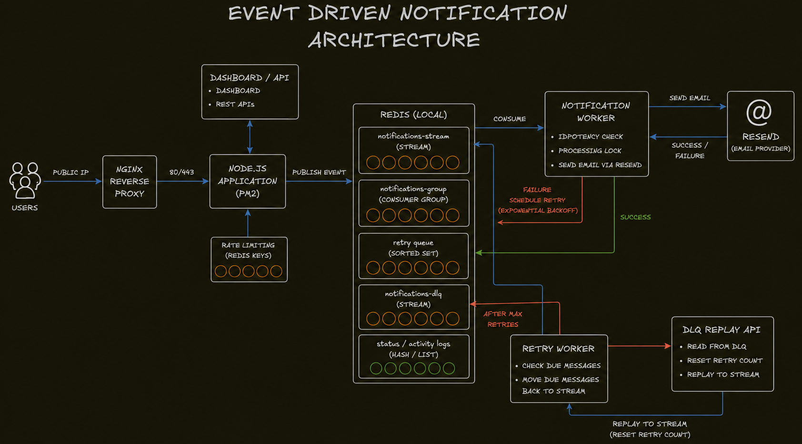
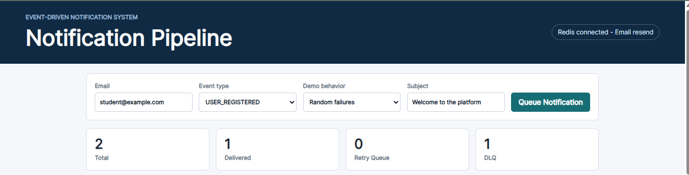
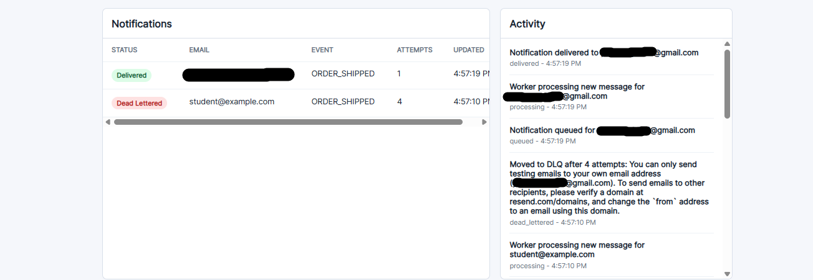
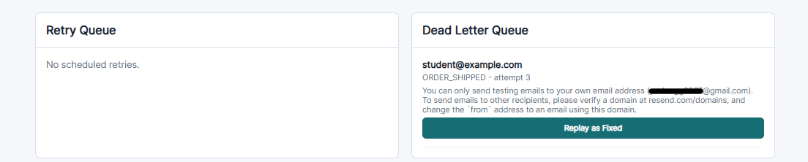

# Event-Driven Notification System

A resilient notification processing system built with **Node.js**, **Express**, **Redis Streams**, and **Resend**.

The system accepts notification requests, queues them asynchronously, sends real emails through Resend, retries failed deliveries with exponential backoff, moves permanently failed messages to a Dead Letter Queue, and supports manual DLQ replay from the dashboard.

## Highlights

- Event-driven notification ingestion using Redis Streams
- Real email delivery through Resend
- Express REST API with a browser dashboard
- Redis consumer group for worker-based processing
- Idempotency keys and processing locks to reduce duplicate delivery
- Exponential-backoff retry queue using a Redis Sorted Set
- Dead Letter Queue for permanently failed messages
- Manual DLQ replay from the dashboard
- Redis-backed API rate limiting to protect the ingestion endpoint
- AWS Lightsail deployment with Nginx, PM2, and local Redis

## Architecture

```text
Users
  -> Nginx reverse proxy
  -> Node.js / Express app
  -> Redis rate limiter
  -> Redis Stream: notifications-stream
  -> Notification Worker
  -> Resend email provider

Failure path:
Notification Worker
  -> retry queue with exponential backoff
  -> Retry Worker
  -> notifications-stream
  -> DLQ after max retries

Recovery path:
Dashboard
  -> DLQ replay API
  -> notifications-stream
```



## Core Flow

1. A user submits a notification request from the dashboard or API.
2. The API checks the Redis-backed rate limit for the client IP.
3. If allowed, the API publishes a notification event to `notifications-stream`.
4. The notification worker consumes the event through `notifications-group`.
5. The worker checks idempotency and acquires a processing lock.
6. The worker sends the email through Resend when `RESEND_API_KEY` is configured.
7. On success, the event is marked as `delivered` and activity is logged.
8. On failure, the event is scheduled in the retry queue with exponential backoff.
9. The retry worker moves due retry messages back to the main stream.
10. After max retries, the event is moved to `notifications-dlq`.
11. Operators can replay DLQ messages from the dashboard after fixing the issue.

## Dashboard

The dashboard lets you:

- queue notification events
- choose event type and demo failure behavior
- monitor total, delivered, retry, and DLQ counts
- inspect notification status and activity logs
- inspect scheduled retries
- inspect DLQ messages
- replay failed DLQ messages back into the stream






## API Endpoints

| Method | Endpoint | Purpose |
| --- | --- | --- |
| `GET` | `/api/health` | Check Redis and email provider status |
| `POST` | `/api/notifications` | Queue a notification event |
| `GET` | `/api/notifications` | List notification statuses |
| `GET` | `/api/logs` | List recent activity logs |
| `GET` | `/api/retry-queue` | Inspect scheduled retry messages |
| `GET` | `/api/dlq` | Inspect dead-lettered messages |
| `POST` | `/api/dlq/:eventId/replay` | Replay a DLQ message |

## Redis Data Structures

| Name | Type | Purpose |
| --- | --- | --- |
| `notifications-stream` | Stream | Main notification event stream |
| `notifications-group` | Consumer Group | Distributes stream messages across workers |
| `notifications-retry-queue` | Sorted Set | Stores failed messages by retry timestamp |
| `notifications-dlq` | Stream | Stores messages that exceeded max retries |
| `notifications-status` | Hash | Stores latest status for each notification |
| `notifications-activity-log` | List | Stores recent dashboard activity |
| `processed:{eventId}` | String | Marks successfully processed events |
| `processing:{eventId}` | String | Locks events currently being processed |
| `rate-limit:notifications:{ip}` | String | Tracks per-IP ingestion request counts |

## Retry And DLQ Behavior

Retries use exponential backoff:

```text
1st failure -> retry after 1 second
2nd failure -> retry after 2 seconds
3rd failure -> retry after 4 seconds
4th failure -> move to DLQ
```

When a message reaches the DLQ, it is preserved for inspection. The dashboard provides a `Replay as Fixed` action that:

- reads the DLQ message
- removes it from the DLQ stream
- resets `retryCount` to `0`
- sets `failMode` to `success` for demo recovery
- publishes it back to `notifications-stream`

## Real Email Delivery

The system sends real email through Resend when `RESEND_API_KEY` is present.

If no Resend key is configured, the system falls back to demo mode so retries, DLQ, replay, and dashboard behavior can still be tested locally.

Create `server/.env`:

```env
RESEND_API_KEY=your_resend_api_key_here
FROM_EMAIL=Notification Demo <onboarding@resend.dev>
PORT=3000
RATE_LIMIT_WINDOW_SECONDS=60
RATE_LIMIT_MAX_REQUESTS=100
```

`server/.env` is intentionally ignored by Git. Use `server/.env.example` as the safe template.

## Run Locally

Prerequisites:

- Node.js 18+
- Redis running on `redis://localhost:6379`

Install dependencies:

```bash
cd server
npm install
```

Start the all-in-one app:

```bash
npm start
```

Open:

```text
http://localhost:3000
```

Health check:

```bash
curl http://localhost:3000/api/health
```

## Run Workers Separately

For a production-like local setup, run workers in separate terminals.

Notification worker:

```bash
cd server
npm run worker:notification
```

Retry worker:

```bash
cd server
npm run worker:retry
```

Producer:

```bash
cd server
npm run producer
```

## Deployment

The project is deployed on AWS Lightsail using:

- Ubuntu server
- Nginx reverse proxy on port `80`
- Node.js app running on port `3000`
- PM2 process manager
- Redis installed locally and bound to localhost
- Resend for external email delivery

See [DEPLOYMENT.md](DEPLOYMENT.md) for the full deployment guide.

## Future Improvements

- Add authentication for the dashboard
- Add HTTPS with a custom domain
- Add automated tests for retry, DLQ, replay, and rate limiting
- Add long-term persistence in PostgreSQL or MongoDB
- Add SMS or push notification provider support
- Add metrics and alerting for worker failures and DLQ growth
